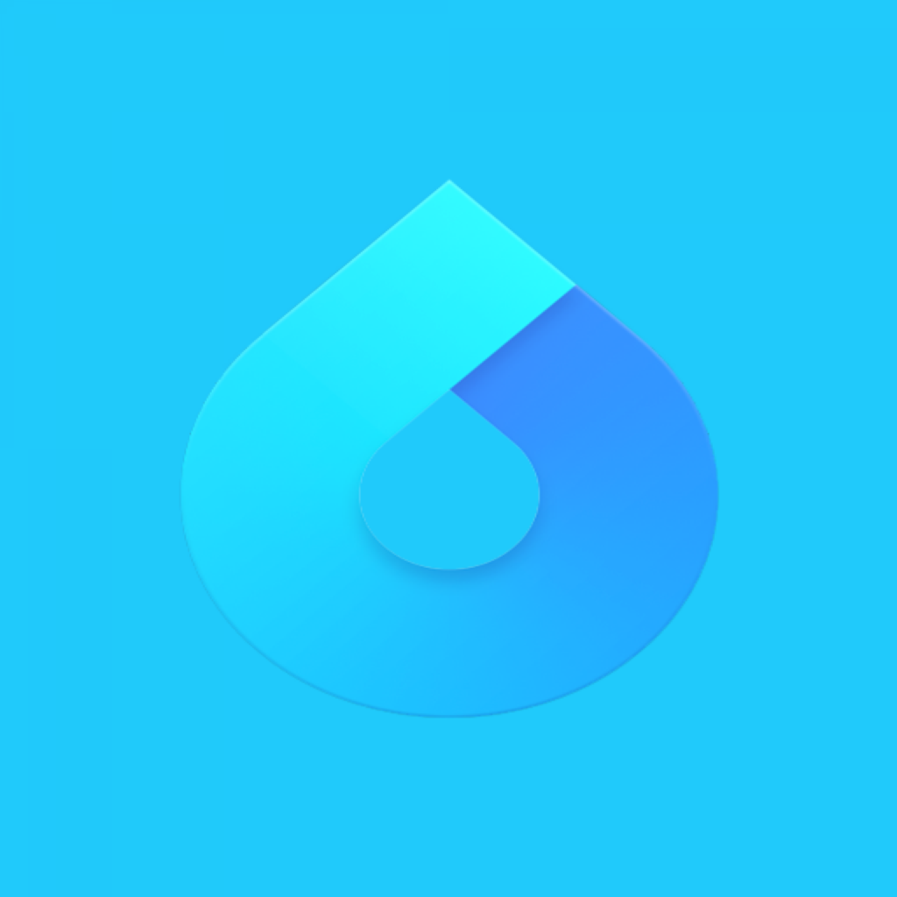

[](http://cocoapods.org/pods/LFAlertController)

# NABWeather
<br />
<p align="center">
  <a href="https://github.com/alexanderritik/Best-README-Template">
    
  </a>
</p>

<p align="center">

</p>

## Table Of Content

- [NABWeather](#nabweather)
  - [Table Of Content](#table-of-content)
  - [Features](#features)
  - [Problem Statement](#problem-statement)
  - [Usage](#usage)
      - [App Id](#app-id)
  - [Architecture](#architecture)
    - [Clean Architecture](#clean-architecture)
  - [Project Structure](#project-structure)
  - [Includes](#includes)
  - [Dependencies](#dependencies)
  - [Author](#author)

## Features

- [x] Get 7 days forecast of a city
- [x] Show average temperature as celsius or fahrenheit
- [x] Random corlor details screen

## Problem Statement

Below are the features that the weather forecast application supported.

- [x] Written in Swift.
- [x] Retrieve the weather information from OpenWeatherMaps API.
- [x] Allow user to input the searching term.
- [x] Proceed searching with a condition of the search term length must be from 3 characters or above.
- [x] Render the searched results as a list of weather items.
- [x] Support caching mechanism so as to prevent the app from generating a bunch of API requests.
- [x] Manage caching mechanism & lifecycle.
- [x] Load the weather icons remotely and displayed one very weather item at the right-hand-side.
- [x] Handle failures.
- [ ] Support the disability to scale large text for who can't see the text clearly.
- [ ] Support the disability to read out the text using VoiceOver controls.

## Usage

#### App Id
Set your app id in config file:
APP_ID = <your_key>

## Architecture

- Clean Architecture + MVVM-C
- Data Binding using RxSwift
- Dependency Injection using Needle

### Clean Architecture

- **Domain Layer:** Is a local swift package that includes business rules and application business rules. Three main components are Entities, Use Cases and Repository Interfaces. Because it contains business stuff so domain must be protected and reuseable. Therefore set it as a framework or package is a best choice.

- **Data Repositories Layer:** The layer contains data logic. E.g: Repository Implementation, Network, Storage. This layer depends on Domain Layer

- **Presentation Layer:** The layer that implement UI logic like navigation, UI appearance and state. Main components are ViewModels, Views, UIModels and Coordinator. This layer depends on Domain Layer.

## Project Structure

```markdown
NABWeather/
|- NABWeather
  |- NABWeatherDomain
  |- Presenter
  |- Data
  |- Coordinator
  |- Config
|- needle-generator
|- weatherforecastTests
|- weatherforecastUITests
```

- `Presenter`: The folder that has files implement Presenter layer.
- `NABWeatherDomain`: The local swift package that implements Domain layer.
- `Data`: The folder that has files implement Data layer
- `Coordinator`: The folder that contains definition of coordinator that implement application's navigation logic.
- `Config`: The folder contains config files.
- `needle-generator`: Contains needle cli to generate needle registration code.

## Includes

- Cache weather forecast base on searching keyword to reduce number of network call.
- Fetch & cache image by using image url.
- Unit Tests for Use Cases(Domain Layer), ViewModels(Presentater Layer).
- UI test with XCUITests.

## Dependencies
This application use SPM to manage its dependencies.
- [Moya](https://github.com/Moya/Moya): Build network layer.
- [RxSwift](https://github.com/ReactiveX/RxSwift): Do data binding.
- [AlamofireImage](https://github.com/Alamofire/AlamofireImage): Download & caching image.
- [Needle](https://github.com/uber/needle): the compile-time safe dependency injection system.

## Author

Sang Le - levansang026@gmail.com
